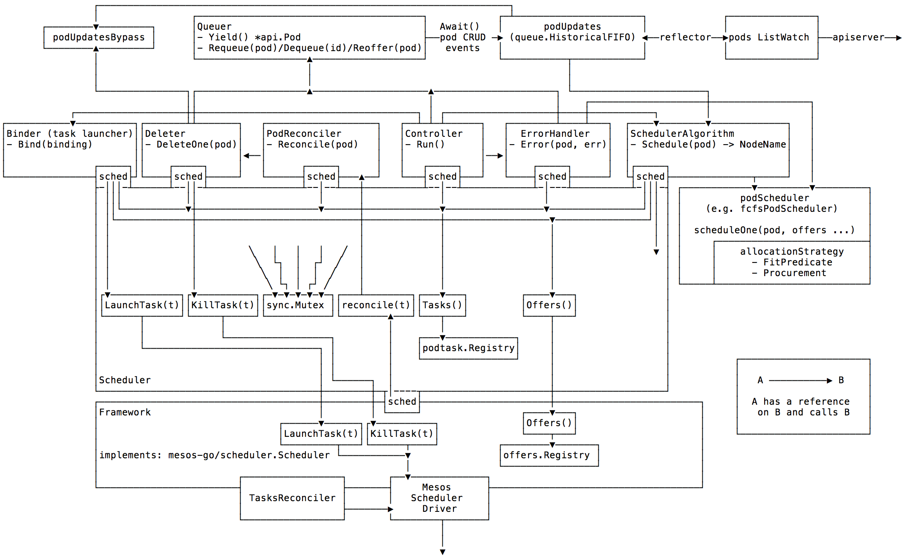

# Kubernetes-Mesos Scheduler

Kubernetes on Mesos does not use the upstream scheduler binary, but replaces it
with its own Mesos framework scheduler. The following gives an overview of
the differences.

## Labels and Mesos Agent Attributes

The scheduler of Kubernetes-Mesos takes [labels][1] into account: it matches
specified labels in pod specs with defined labels of nodes.

In addition to user defined labels, [attributes of Mesos agents][2] are converted
into node labels by the scheduler, following the pattern

```yaml
k8s.mesosphere.io/attribute-<name>: value
```

As an example, a Mesos agent attribute of `generation:2015` will result in the node label

```yaml
k8s.mesosphere.io/attribute-generation: 2015
```

and can be used to schedule pods onto nodes which are of generation 2015.

**Note:** Node labels prefixed by `k8s.mesosphere.io` are managed by
Kubernetes-Mesos and should not be modified manually by the user or admin. For
example, the Kubernetes-Mesos executor manages `k8s.mesosphere.io/attribute`
labels and will auto-detect and update modified attributes when the mesos-slave
is restarted.

## Tuning

The scheduler configuration can be fine-tuned using an ini-style configuration file.
The filename is passed via `--scheduler_config` to the `km scheduler` command.

Be warned though that some them are pretty low-level and one has to know the inner
workings of k8sm to find sensible values. Moreover, these settings may change or
even disappear from version to version without further notice.

The following settings are the default:

```
[scheduler]
; duration an offer is viable, prior to being expired
offer-ttl = 5s

; duration an expired offer lingers in history
offer-linger-ttl = 2m

; duration between offer listener notifications
listener-delay = 1s

; size of the pod updates channel
updates-backlog = 2048

; interval we update the frameworkId stored in etcd
framework-id-refresh-interval = 30s

; wait this amount of time after initial registration before attempting
; implicit reconciliation
initial-implicit-reconciliation-delay = 15s

; interval in between internal task status checks/updates
explicit-reconciliation-max-backoff = 2m

; waiting period after attempting to cancel an ongoing reconciliation
explicit-reconciliation-abort-timeout = 30s

initial-pod-backoff = 1s
max-pod-backoff = 60s
http-handler-timeout = 10s
http-bind-interval = 5s
```

## Low-Level Scheduler Architecture



[1]: ../../../docs/user-guide/labels.md
[2]: http://mesos.apache.org/documentation/attributes-resources/

[]()
